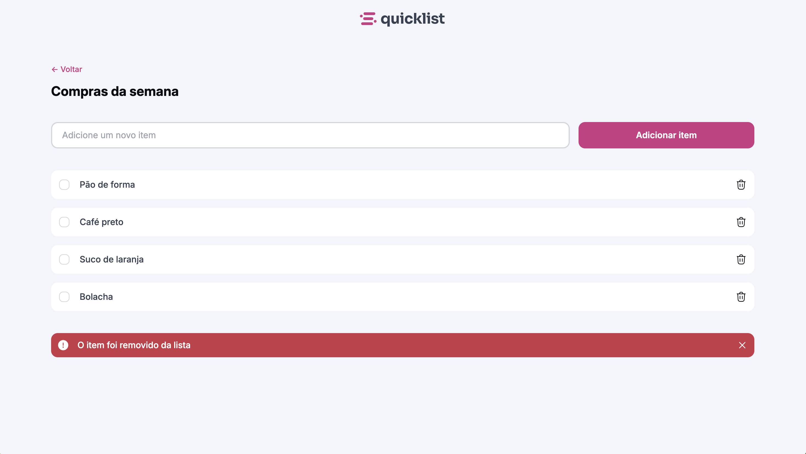

# 🛒 Quicklist — Lista de Compras

[]()
[]()
[]()

> Projeto prático da formação **FullStack** da [Rocketseat](https://www.rocketseat.com.br/).  
> Aplicativo de lista de compras para organizar itens do dia a dia.

---

## 📸 Preview

  
*(adicione aqui um print do Quicklist em funcionamento — salve como `assets/preview.png`)*

---

## 📄 Sobre o projeto

O **Quicklist** é uma aplicação web simples para criar uma lista de compras.  
O usuário pode adicionar itens à lista, visualizar o que já está listado, marcar como comprado e remover.

A proposta do projeto é focar em:

- Interface limpa e intuitiva  
- Uso de JavaScript para manipulação dinâmica da lista  
- Organização de estilo e scripts  
- Experiência de uso leve e eficiente  

---

## 🛠 Tecnologias utilizadas

- **HTML5**  
- **CSS3**  
- **JavaScript**  

---

## 📂 Estrutura do projeto

```bash
Quicklist/
├── assets/         # imagens, ícones e previews
├── scripts/        # arquivos JavaScript
├── styles/         # arquivos CSS
├── index.html      # página principal
└── README.md       # este arquivo
```

```bash
git clone https://github.com/pollyana-valverde/Quicklist.git
```
```bash
cd Quicklist
```
---

👩‍💻 Autora

Feito por Pollyana Valverde
.
Projeto proposto pela Rocketseat
.

